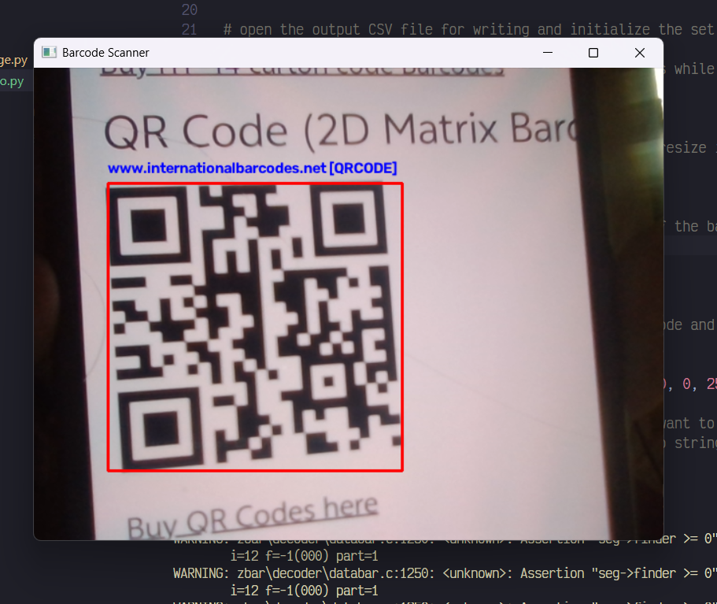

# Barcode Scanner form Images

A small python practice project that detects and decodes barcodes from static images and video streams using OpenCV and pyzbar.

## Features

- Detects and decodes barcodes from static images
- Detects and decodes barcodes from live video streams
- Supports multiple barcode formats through pyzbar
- Extracts barcode data and barcode type 
- Draws bounding boxes around detected barcodes
- Displays decoded barcodes information
- Stores the timestamp and output data into a csv file

## Requirements

- python 3
- OpenCV
- pyzbar
- imutils

## Installation
```bash
pip install -r requirements.txt
```

## Usage
### 1. Image
```bash
python barcode_scanner_image.py -i "path/to/image.png"
```

### Example
```bash
python barcode_scanner_image.py -i "Sample Images/HP.png"
```

### 2. Video Stream
The video scanner captures frames from a connected camera and continuously searches for detectable barcodes.

```bash
python barcode_scanner_video.py
```

## Output Examples 
### Image Scanner
The image scanner successfully detects the barcodes, draws a bounding around it, and displays the decoded barcode data.

.png)
.png)

### Video Scanner 
The video scanner continuously processes frames from the camera and detects barcodes in real time.



## Project Structure

```text
BARCODESCANNER/
│
├── sample_images/
│   └── Test barcode images
│
├── output_images/
│   └── Screenshots demonstrating successful detection
│
├── barcode_scanner_image.py
├── barcode_scanner_video.py
├── requirements.txt
├── README.md
└── .gitignore